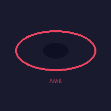

# AiVill

Adaptive AI Villains for Games

<p align="center">
Adaptive AI Villains for Games
</p>

<p align="center">
Self-learning game enemies that observe, adapt, and evolve.
</p>

[](https://pypi.org/project/aivill/)
[](https://pypi.org/project/aivill/)
[](https://opensource.org/licenses/MIT)
[](https://github.com/aivill/aivill/stargazers)

## PyPI

AiVill is now available on PyPI.

https://pypi.org/project/aivill/

<p align="center">
  
</p>

<h1 align="center">AiVill</h1>

<p align="center">
Adaptive AI Villains for Games
</p>

AiVill is a **modular AI engine that creates adaptive villains capable of learning player behavior and evolving strategies across sessions**.

Most video game enemies are scripted AI that follow fixed logic. AiVill instead creates villains that **observe, learn, adapt, and evolve** — making each player encounter unique.

---

## Why AiVill Exists

Most game AI is static. Villains follow predictable patterns, exploit the same weaknesses, and never truly "learn" from player behavior.

AiVill explores a different approach: **adaptive antagonists that evolve with the player**. Instead of hardcoded behavior trees, the villain:

* Observes how you play
* Remembers your strategies
* Adapts its tactics
* Evolves over multiple encounters
* Develops personality traits based on outcomes

The goal isn't just a harder enemy — it's a **living antagonist** that makes each playthrough feel different.

---

## Key Features

* **Adaptive Villain AI** — Villains that learn from player behavior and adapt strategies
* **Persistent Memory** — Remember player patterns across sessions
* **Reinforcement Learning** — Strategy effectiveness updates based on outcomes
* **Strategy Evolution** — Automatic mutation and improvement of tactics
* **Personality System** — Six trait dimensions that shape villain behavior
* **Ollama LLM Integration** — Optional local LLMs for reasoning and dialogue
* **Modular Architecture** — Swap components as needed
* **Game-Agnostic Design** — Integrate with any game genre
* **Simple API** — Full integration in under 10 lines of code

---

## Installation

```bash
pip install aivill
```

## Quick Start

```python
from aivill import VillainEngine

# Create and initialize
villain = VillainEngine()
villain.initialize({"data_dir": "data"})

# Game loop
while game_running:
    villain.update_state(game_state)
    action = villain.decide_action()
    villain.learn_from_result(result)

villain.save_memory()
```

For more examples, see the [examples](examples/) directory.

---

## How AiVill Works

```
┌─────────────────────────────────────────────────────────────────┐
│                        GAME LOOP                                 │
├─────────────────────────────────────────────────────────────────┤
│                                                                  │
│   ┌─────────┐    ┌─────────┐    ┌─────────┐    ┌─────────┐    │
│   │  Game   │───▶│ AiVill  │───▶│Decision │───▶│ Execute │    │
│   │ State   │    │ Engine  │    │         │    │ Action  │    │
│   └─────────┘    └─────────┘    └─────────┘    └─────────┘    │
│                      │    │                                    │
│                      ▼    │                                    │
│               ┌──────────┴─────┐                               │
│               │   Learning    │                               │
│               │   + Memory    │                               │
│               └───────────────┘                               │
│                                                                  │
└─────────────────────────────────────────────────────────────────┘
```

### The Learning Loop

1. **Observe** — Game state updates the villain's perception
2. **Remember** — Player patterns stored in memory
3. **Decide** — Strategy selected based on personality + learning
4. **Act** — Villain executes action
5. **Learn** — Outcome updates strategy effectiveness
6. **Adapt** — Personality and strategies evolve

Over time, the villain becomes **smarter** and develops its own **playstyle**.

---

## Architecture

```
┌─────────────────────────────────────────────────────────────────┐
│                        AiVill Engine                            │
├─────────────────────────────────────────────────────────────────┤
│                                                                  │
│  ┌─────────────┐  ┌─────────────┐  ┌─────────────────────┐    │
│  │ Perception  │  │   Memory    │  │   Personality       │    │
│  │   System    │  │   System    │  │     Engine          │    │
│  └─────────────┘  └─────────────┘  └─────────────────────┘    │
│                                                                  │
│  ┌─────────────┐  ┌─────────────┐  ┌─────────────────────┐    │
│  │  Strategy   │  │  Learning   │  │      Decision       │    │
│  │   Engine    │──│   Engine    │──│      Engine         │    │
│  └─────────────┘  └─────────────┘  └─────────────────────┘    │
│                                                                  │
│  ┌─────────────┐  ┌─────────────┐                              │
│  │     LLM    │  │   Event     │                              │
│  │  Interface │  │   Logger    │                              │
│  └─────────────┘  └─────────────┘                              │
│                                                                  │
└─────────────────────────────────────────────────────────────────┘
```

### Components

| Component | Description |
|-----------|-------------|
| **Perception System** | Analyzes game state, extracts observations |
| **Memory System** | Stores player profiles, strategy history, events |
| **Personality Engine** | Six trait dimensions affecting decision-making |
| **Strategy Engine** | Manages tactics, evaluates effectiveness |
| **Learning Engine** | Reinforcement updates, pattern recognition |
| **Decision Engine** | Integrates all systems to select actions |
| **LLM Interface** | Optional Ollama integration for reasoning |
| **Event Logger** | Records all interactions for analysis |

---

## Quick Start

### Installation

```bash
# Clone the repository
git clone https://github.com/aivill/aivill.git
cd aivill

# Install in development mode
pip install -e .

# Or install dependencies only
pip install -r requirements.txt
```

### Basic Usage

```python
from aivill import VillainEngine

# Create and initialize
villain = VillainEngine()
villain.initialize({
    "name": "Lord of Shadows",
    "data_dir": "data",
    "log_dir": "logs"
})

# Set personality (optional)
villain.load_personality({
    "traits": {
        "aggression": 0.8,
        "patience": 0.4,
        "ego": 0.9,
        "chaos": 0.3,
        "adaptability": 0.7,
        "caution": 0.3
    }
})

# Game loop
while game_running:
    # Update with current game state
    game_state = {
        "player_health": 80,
        "villain_health": 100,
        "player_last_action": "attack",
        "round_number": 5
    }
    observations = villain.update_state(game_state)
    
    # Get villain's decision
    decision = villain.decide_action()
    print(f"Villain chooses: {decision['action']}")
    
    # Execute action in your game...
    
    # Learn from result
    result = {
        "outcome": "victory",
        "success": True,
        "reward": 1.0
    }
    villain.learn_from_result(result)

# Save memory for next session
villain.save_memory()
```

### Game State Format

```python
game_state = {
    "player_health": 80,           # 0-100
    "villain_health": 100,         # 0-100
    "player_last_action": "attack", # Player's last action
    "round_number": 5,             # Current round
    "available_actions": [         # What villain can do
        "attack", "defend", "retreat", "set_trap", "taunt"
    ],
    "environment_objects": [        # What's in the environment
        "trap", "cover", "weapon"
    ],
    "player_id": "hero_001"        # Optional player identifier
}
```

### Result Format

```python
result = {
    "outcome": "victory",          # Outcome type
    "success": True,               # Did it work?
    "reward": 1.0,                 # Reward value (-1 to 1)
    "damage_dealt": 20,            # Damage to player
    "damage_received": 5           # Damage to villain
}
```

---

## Ollama Integration

AiVill can optionally use **local LLMs via Ollama** for enhanced reasoning.

### Setup

1. Install [Ollama](https://ollama.ai)
2. Pull a model:

```bash
ollama pull phi3.5      # 2.2GB - Good balance
ollama pull qwen2.5     # 986MB - Best for edge
ollama pull llama3     # 4.9GB - Most capable
```

### Enable LLM

```python
villain = VillainEngine({
    "llm_model": "qwen2.5",  # Or phi3.5, llama3, etc.
    "llm_enabled": True
})
```

### LLM Features

* **Strategy Suggestions** — "What should the villain do against an aggressive player?"
* **Behavior Analysis** — "What patterns has this player shown?"
* **Villain Dialogue** — Generate menacing taunts and monologue
* **Strategy Mutation Ideas** — AI-generated tactical variations

> **Note:** LLM calls are slow (~2-10 seconds). Disable for real-time gameplay.

---

## Examples

### Terminal Demo

Run an interactive simulation:

```bash
python -m examples.automated_test
```

### Stress Test

Test performance with 500+ iterations:

```bash
python -m examples.stress_test
```

---

## AiVill Experiment Playground

Run experiments to observe adaptive villain behavior:

```bash
# Learning demo - watch villain learn from player patterns
python experiments/learning_demo.py

# Strategy evolution demo - observe strategy mutations
python experiments/strategy_evolution_demo.py

# Pattern detection demo - test player pattern recognition
python experiments/player_pattern_test.py
```

### What You'll See

- **Learning Demo** — Villain win rate improves from ~20% to ~80% as it learns
- **Evolution Demo** — Strategies mutate and adapt over 100 rounds
- **Pattern Test** — Detect player archetypes (aggressive, defensive, evasive)

---

## Villain Leaderboard

Community rankings for the smartest villains:

| Rank | Name | Strategy | Win Rate |
|------|------|----------|----------|
| 1 | trap_master_v2 | adaptive_trap_strategy | 91% |
| 2 | chaos_overlord | chaos_manipulation | 86% |
| 3 | mind_reader | predictive_counter | 82% |
| 4 | aggressive_berserker | rush_strategy | 78% |
| 5 | defensive_turtle | fortress_strategy | 65% |

### Submit Your Villain

```python
from leaderboard import VillainLeaderboard

lb = VillainLeaderboard()
lb.add_entry(
    villain_name="my_villain",
    strategy="my_strategy",
    win_rate=0.85,
    rounds_tested=100,
    personality={...}
)
```

See [Leaderboard](leaderboard/README.md) for full submission guidelines.

---

## Villain Personality Generator

Generate unique villain personalities:

```python
from villains import PersonalityGenerator

generator = PersonalityGenerator()

# Random personality
villain = generator.generate_random()

# From archetype
villain = generator.generate_from_archetype("the_mind_reader")

# Pre-made villains
from villains import load_villain
villain = load_villain("chaos_overlord")
```

### Available Archetypes

- **the_calculating_tyrant** — Patient strategist
- **the_chaos_overlord** — Unpredictable force
- **the_mind_reader** — Master psychologist
- **the_aggressive_berserker** — Relentless warrior
- **the_defensive_turtle** — Impenetrable defense
- And more!

See [Villain Generator](villains/README.md) for full documentation.

---

## Configuration

### Personality Traits

| Trait | Range | Effect |
|-------|-------|--------|
| `aggression` | 0-1 | Prefers offensive actions |
| `patience` | 0-1 | Willing to wait and plan |
| `ego` | 0-1 | Risk tolerance, confidence |
| `chaos` | 0-1 | Tendency for random actions |
| `adaptability` | 0-1 | Speed of learning |
| `caution` | 0-1 | Defensive preference |

### Config File

```python
from aivill import Config

config = Config({
    "name": "Custom Villain",
    "llm_model": "qwen2.5",
    "personality": {
        "aggression": 0.7,
        "patience": 0.3,
        "ego": 0.8,
        "chaos": 0.2,
        "adaptability": 0.8,
        "caution": 0.2
    }
})
```

---

## Repository Structure

```
aivill/
├── aivill/                    # Main package
│   ├── __init__.py           # Exports
│   ├── config.py             # Configuration
│   ├── exceptions.py          # Custom exceptions
│   ├── core/                  # Engine, decisions
│   ├── memory/                # Memory management
│   ├── learning/              # Reinforcement learning
│   ├── strategy/              # Strategy engine + mutations
│   ├── personality/           # Personality traits
│   ├── llm/                   # Ollama client
│   └── logging/               # Event logger
│
├── examples/                  # Demo scripts
│   ├── automated_test.py
│   ├── stress_test.py
│   └── terminal_demo.py
│
├── tests/                     # pytest suite
├── docs/                      # Documentation
├── data/                      # Memory storage
├── logs/                      # Event logs
└── pyproject.toml            # Package config
```

---

## Built With

* **Python** — Core language
* **Reinforcement Learning** — Q-learning strategy updates
* **Local LLMs (Ollama)** — Optional reasoning
* **Modular Architecture** — Swappable components

---

## Roadmap

- [ ] Advanced reinforcement learning algorithms
- [ ] Emergent strategy generation
- [ ] Multi-agent villain ecosystems
- [ ] Environment awareness system
- [ ] Visualization tools
- [ ] Unity/Unreal engine plugins
- [ ] Web-based dashboard

---

## AiVill Research Playground

AiVill is an **experimental platform for adaptive AI research in games**.

### Open Research Ideas

* **Emergent Villain Strategies** — Can strategies evolve beyond human design?
* **Player Psychology Modeling** — Detecting and exploiting player tendencies
* **Adaptive Boss Battles** — Learning bosses that counter player builds
* **Narrative-Aware Antagonists** — Villains that remember story events
* **Multi-Agent Ecosystems** — Villain factions that coordinate
* **Transfer Learning** — Villains that learn across multiple games

---

## The Adaptive Villain Challenge

Can you create the **most intelligent villain** using AiVill?

### Challenge

Build a villain that:

1. Learns a player's strategy within 10 rounds
2. Adapts to counter the player's strengths
3. Defeats the player within 20 rounds

### Submit

* Share your strategies, configurations, and results
* Open an issue with your approach
* Submit pull requests with improvements

Let's push adaptive AI in games forward together!

---

## Contributing

Contributions welcome! Areas of interest:

* **AI Algorithms** — Improve learning, strategy selection
* **Strategy Mutations** — Novel tactical variations
* **Reinforcement Learning** — Better reward functions
* **LLM Prompts** — More intelligent reasoning
* **Game Integrations** — Unity, Godot, Unreal wrappers
* **Performance** — Edge deployment optimizations

See [CONTRIBUTING.md](docs/CONTRIBUTING.md) for guidelines.

---

## License

MIT License — See [LICENSE](LICENSE) for details.

---

## Vision

AiVill aims to transform game villains from **scripted obstacles** into **genuine adversaries that learn, adapt, and evolve**.

Every player deserves an antagonist who:

* Remembers their past victories
* Learns from their mistakes
* Develops a unique personality
* Makes each encounter feel alive

That's the future AiVill is building.

---

## Repository Topics

`ai` `game-ai` `adaptive-ai` `reinforcement-learning` `procedural-ai` `game-development` `ai-agents` `ollama` `llm` `game-enemy-ai` `self-learning` `adaptive-villain`

---

## Star History

If AiVill inspires you, please ⭐ star the repository to show your support!

[](https://star-history.com/#aivill/aivill&Date)

---

**Star AiVill today and help create the next generation of game AI!**
